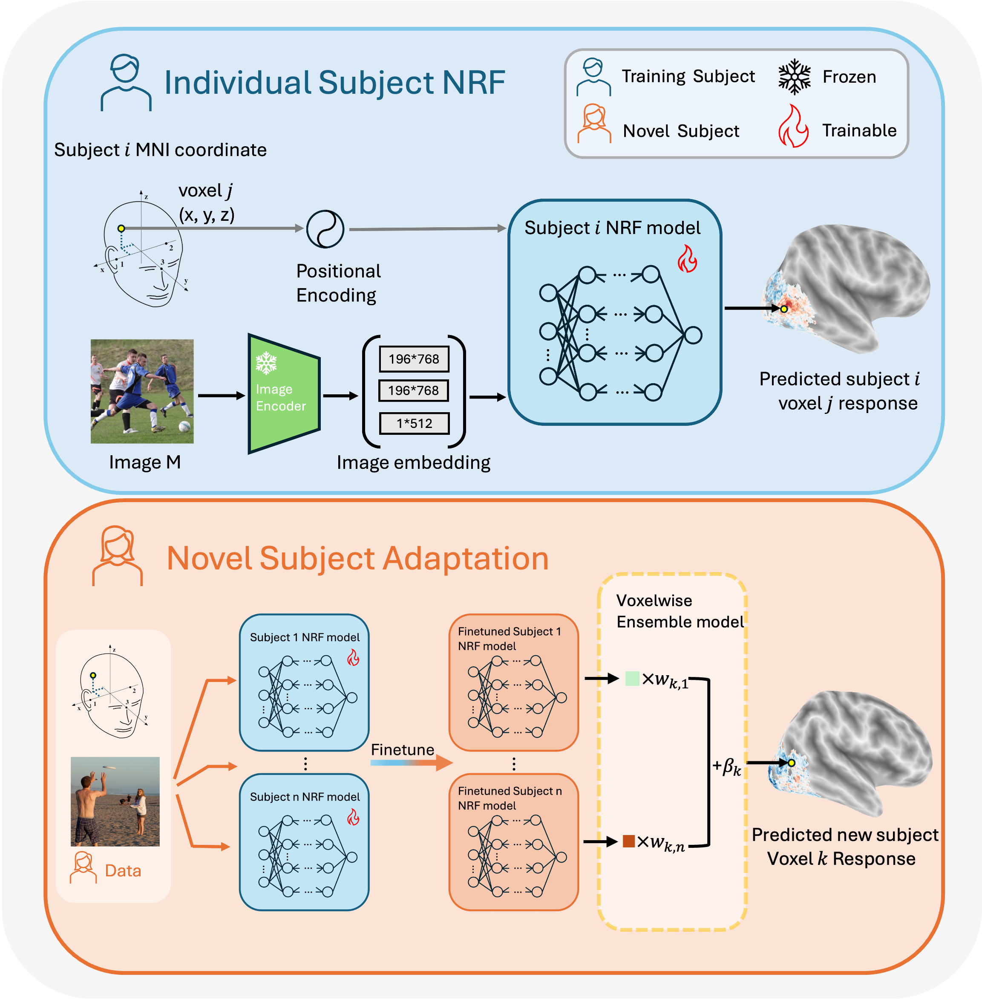

# Beyond Grid-Locked Voxels: Neural Response Functions for Continuous Brain Encoding

<p><b><font size="5">Haomiao Chen, Keith W. Jamison, Mert R. Sabuncu, Amy Kuceyeski</font></b></p>

<p>ICLR 2026</p>

[[Paper link]](https://arxiv.org/abs/2510.07342)

This is the official code release for *Beyond Grid-Locked Voxels: Neural Response Functions for Continuous Brain Encoding*.

<p align="center">
  
</p>

## Repository layout

```
main_train.py               # single entrypoint (train / finetune / evaluate)
config.yaml                 # project-level paths and per-subject ROI lists
training_config.yaml         # example experiment config

utils/
  config.py                  # config loading, CLI parser, path helpers

train/
  nrf_trainer.py             # NRFTrainer class (training loop, eval, checkpointing)
  training_utils.py          # loss, scoring, positional embedding, checkpoint I/O
  dataloader.py              # NSD dataset loader (returns raw images)
  validation_idx.npy         # 907 NSD image IDs from the shared-1k set (shown to all subjects)

model/
  nrf_encoder.py             # NRF MLP encoder
  Feature_merger.py           # merges two CLIP hidden-layer feature maps
  image_encoder.py           # frozen CLIP ViT wrapper (HuggingFace transformers)

voxel_regression.py          # voxel-wise linear ensemble on saved predictions

nsd_data_processing/                # preprocessing: raw NSD betas -> ROI responses
  getROImask.py              #   step 1: save ROI masks + MNI coordinates
  getmaskedROI.py            #   step 2: apply masks, save trial-level responses
  getmaskedROIaverage.py     #   step 3: average repeated trials by image id
  common.py                  #   shared helpers for the three steps

```

## Setup

```bash
pip install -r requirements.txt
```

Edit `config.yaml` with your local paths:

```yaml
paths:
  # NSD raw input — each *_dir contains subjXX/ subdirectories
  brain_mask_dir: "/path/to/nsddata/ppdata"         # subjXX/func1pt8mm/brainmask.nii.gz
  roi_label_dir:  "/path/to/nsddata/ppdata"         # subjXX/func1pt8mm/roi/*.nii.gz
  transforms_dir: "/path/to/nsddata/ppdata"         # subjXX/transforms/MNI-to-func1pt8.nii.gz
  betas_dir:      "/path/to/nsddata_betas/ppdata"   # subjXX/func1pt8mm/betas_fithrf_GLMdenoise_RR/
  expdesign_mat:  "/path/to/nsd_expdesign.mat"      # single file
  stimuli_dir:    "/path/to/nsd_stimuli"            # S{subject}_stimuli_227.h5py

  # Output directories
  data_root: "/path/to/processed_nsd/"   # preprocessing output, training reads from here
  save_root: "/path/to/nrf_runs"
```

For a standard NSD download, `brain_mask_dir`, `roi_label_dir`, and `transforms_dir` all point to the same `ppdata/` directory. If you have custom preprocessing, point each to wherever those files live.

## NSD data preprocessing

### Downloading stimulus images

The training dataloader requires pre-resized 227x227 NSD stimulus images
(`S{subject}_stimuli_227.h5py`, one per subject). Download them from Hugging Face:

```bash
pip install huggingface_hub
huggingface-cli download haomiao8/NRF-stimuli --repo-type dataset --local-dir /path/to/stimuli
```

Then set `stimuli_dir` in `config.yaml` to the directory you downloaded them to.

### Preprocessing raw NSD betas

Before training, you need to preprocess raw NSD beta sessions into per-ROI response files.
See [`nsd_data_processing/README.md`](nsd_data_processing/README.md) for full details.

Quick version:

```bash
python -m nsd_data_processing.getROImask          --subject 1
python -m nsd_data_processing.getmaskedROI        --subject 1
python -m nsd_data_processing.getmaskedROIaverage --subject 1
```

NSD input data is read from the per-category paths in `config.yaml`.
Processed outputs are written under `data_root/roi_masks/subjXX/`,
`data_root/roi_response/subjXX/`, `data_root/roi_response_average/subjXX/`,
and `data_root/MNI_coordinate/subjXX/`.
The training dataloader reads from the same processed tree.

## Two config files

| File | Purpose |
|---|---|
| `config.yaml` | **Project-level.** Data paths and per-subject ROI lists. Shared across all runs. |
| Experiment config (e.g. `training_config.yaml`) | **Per-run.** Training hyperparameters, model architecture, data source, evaluation options. |

CLI arguments override any value in the experiment config. The override is explicit:
each flag maps to exactly one config key (e.g. `--epochs` -> `training.epochs`).

## Training

```bash
python main_train.py \
  --exp_name trn_subj1 \
  --exp_config_dir training_config.yaml
```

This creates `<save_root>/trn_subj1/` with checkpoints, TensorBoard logs, and evaluation outputs.

<!-- ### Choosing `training_image_idx`

`training_image_idx` should contain **NSD image IDs**, not response row indices.

- If `data_src.training_image_idx: null`, the dataloader uses IDs `>= 1000` by default (non-shared1k).
- If you provide a `.npy`, each value must exist in `data_root/roi_response_average/subjXX/image_order.npy`.
- The dataloader maps each image ID to a response row by matching against `image_order.npy`.

Example: sample 2000 random non-shared1k IDs for one subject:

```bash
python - <<'PY'
import numpy as np

subject = 1
num_images = 2000
data_root = "/path/to/processed_nsd"
order = np.load(f"{data_root}/roi_response_average/subj{subject:02d}/image_order.npy").astype(np.int32)
candidate_ids = order[order >= 1000]  # exclude shared1k
chosen = np.random.choice(candidate_ids, size=num_images, replace=False).astype(np.int32)
np.save(f"subj{subject:02d}_train_ids.npy", chosen)
print("saved", chosen.shape, "to", f"subj{subject:02d}_train_ids.npy")
PY
```

Then pass it with `--training_image_idx subj01_train_ids.npy` (or set `data_src.training_image_idx` in YAML). -->

## Fine-tuning

```bash
python main_train.py \
  --exp_name ft_s1_to_s3 \
  --pretrained_config_dir trn_subj1 \
  --pretrained_ckpt_name best_model \
  --data_subject_list 3 \
  --training_image_idx /path/to/subj3_train_ids.npy
```

When `--pretrained_config_dir` is given, the mode is automatically set to `finetune`.
The experiment config is loaded from `<save_root>/trn_subj1/experiment_config.yaml`.

Use `--train_encoder` / `--no-train_encoder` and `--train_feature_merger` / `--no-train_feature_merger`
to control which components are updated during fine-tuning (both default to off in the config).

## Evaluation

```bash
python main_train.py \
  --exp_name eval_subj1 \
  --exp_config_dir training_config.yaml \
  --mode evaluate \
  --data_subject_list 1 \
  --eval_subject_list 1
```

Writes predictions, targets, and per-voxel correlations to `<exp_name>/<output_name>.h5py`.

## Voxel regression

`voxel_regression.py` fits a per-voxel linear ensemble on top of **saved** NRF predictions
(it does not re-run the NRF models). Each voxel gets its own weights:
`ground_truth = w1*pred_model1 + w2*pred_model2 + ... + bias`.

Workflow:
1. Fine-tune several NRF models (e.g. one per source subject). Each run saves
   `ft_data.h5py` (train-split predictions) and `best_epoch.h5py` (val-split predictions).
2. Run voxel regression on those saved files.

**Typical usage** (ground truth read from the same H5 files):

```bash
python voxel_regression.py \
  --ensemble-subjects 1 5 7 \
  --target-subject 2 \
  --train-prediction-sources s1_ft/ft_data.h5py s5_ft/ft_data.h5py s7_ft/ft_data.h5py \
  --eval-prediction-sources  s1_ft/best_epoch.h5py s5_ft/best_epoch.h5py s7_ft/best_epoch.h5py \
  --train-ground-truth-h5 s1_ft/ft_data.h5py \
  --eval-ground-truth-h5  s1_ft/best_epoch.h5py \
  --roi nsdgeneral \
  --fit-intercept \
  --save-dir output/
```

If your prediction files contain a subset of training images, pass `--train-image-idx subset.npy`
so the script knows which rows to align.

To load ground truth directly from NSD response files instead of H5:

```bash
python voxel_regression.py \
  --ensemble-subjects 1 5 7 \
  --target-subject 2 \
  --train-prediction-sources s1_ft/ft_data.h5py s5_ft/ft_data.h5py s7_ft/ft_data.h5py \
  --eval-prediction-sources  s1_ft/best_epoch.h5py s5_ft/best_epoch.h5py s7_ft/best_epoch.h5py \
  --ground-truth-source nsd \
  --roi nsdgeneral \
  --fit-intercept \
  --save-dir output/
```

Outputs saved to `--save-dir`:
- `weights_per_voxel.npy` — ensemble weights per voxel, shape `(num_voxels, num_models)`
- `bias_per_voxel.npy` — per-voxel bias term
- `train_corr_per_voxel.npy` / `eval_corr_per_voxel.npy` — per-voxel Pearson correlations
- `voxel_regression_results.h5py` — all of the above plus coordinates and metadata


## CLI reference

All flags are optional and override the corresponding experiment config value.

| Flag | Config key | Description |
|---|---|---|
| `--exp_name` | — | Output directory name under `save_root` |
| `--exp_config_dir` | — | Path to experiment config YAML (file or directory) |
| `--mode` | `training.mode` | `train` / `finetune` / `evaluate` |
| `--epochs` | `training.epochs` | Number of training epochs |
| `--batch_size` | `training.batch_size` | Batch size |
| `--learning_rate` | `training.learning_rate` | Learning rate |
| `--shuffle_coord` | `training.shuffle_coord` | Randomly permute voxel order per batch |
| `--subsample_voxels` | `training.subsample_voxels` | Subsample a fixed number of voxels per batch |
| `--num_voxels` | `training.num_voxels` | Number of voxels to subsample (requires `subsample_voxels: true`) |
| `--data_subject_list` | `data_src.data_subject_list` | Training subject id(s) |
| `--roi_list` | `data_src.roi_list` | ROI name(s) (e.g. `nsdgeneral`, `FFA1 PPA V1v`) |
| `--training_image_idx` | `data_src.training_image_idx` | `.npy` file with training image ids |
| `--pretrained_config_dir` | `finetune.pretrained_config_dir` | Previous experiment dir for fine-tuning |
| `--pretrained_ckpt_name` | `finetune.pretrained_ckpt_name` | Checkpoint name (e.g. `best_model`) |
| `--train_encoder` | `finetune.train_encoder` | Unfreeze NRF encoder during fine-tuning |
| `--train_feature_merger` | `finetune.train_feature_merger` | Unfreeze feature merger during fine-tuning |
| `--eval_subject_list` | `evaluation.subject_list` | Subject(s) to evaluate (null = same as `data_subject_list`) |
| `--eval_roi_list` | `evaluation.roi_list` | ROI(s) to evaluate (null = same as `roi_list`) |
| `--eval_output_name` | `evaluation.output_name` | Name for the output `.h5py` file |

> **Note:** When `evaluation` fields are `null`, validation uses the same subjects and ROIs specified under `data_src`.

## Train / validation split

The file `train/validation_idx.npy` contains 907 NSD image IDs from the shared-1k set
(images shown to all 8 NSD subjects). These are held out for validation.

When `training_image_idx` is null, the dataloader uses all image IDs >= 1000 for training
(non-shared-1k). The 907 shared-1k IDs in `validation_idx.npy` are always used for
end-of-epoch validation regardless of training set.
